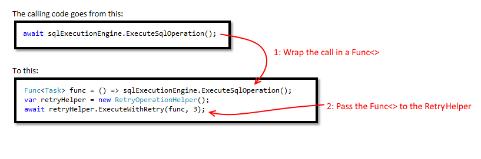

# RetryOperationHelper
Retry Operation Helper is a simple class which encapsulates the retry of any given piece of C# .NET logic a given number of times before failing, as well as running an optional function on failure. It is useful for any call where transient exception are possible, for example, making a call to a remote database or service.

#Licenses
Retry Operation Helper is licensed under the [MIT license](LICENSE.TXT).

RetryOperationHelper uses third-party libraries or other resources that may be 
distributed under licenses different than RetryOperationHelper. 

#Demo


#Usage
Create a RetryOperationHelper object and pass it a Func<> object containing whatever piece of logic you need retried. From then on, that logic will be retried the given number of times before the exception is thrown back to the original thread.  For example, the code goes from this: 

````
await sqlExecutionEngine.ExecuteSqlOperation();
````
to 

````
Func<Task> func = () => sqlExecutionEngine.ExecuteSqlOperation();
await RetryOperationHelper.ExecuteWithRetry(func, 3); 
````

It is useful for code calling databases or anywhere transient issues may be present. Always pass atomic pieces of logic, usually a single call, given the entire code block will be retried if any part of it throws an exception. 

#Microsoft Open Source Code of Conduct
This project has adopted the [Microsoft Open Source Code of Conduct](https://opensource.microsoft.com/codeofconduct/). For more information see the [Code of Conduct FAQ](https://opensource.microsoft.com/codeofconduct/faq/) or contact [opencode@microsoft.com](mailto:opencode@microsoft.com) with any additional questions or comments.
